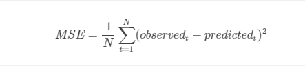
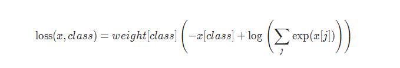
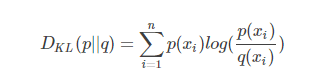

##楼主吐血整理了pytorch的19种损失函数，学会后吊打面试官
损失函数在pytorch中是在torch.nn包实现的，可以自己实现和调包

### 1.自己实现

```python
criterion = LossCriterion() #构造函数有自己的参数
loss = criterion(x, y) #调用标准时也有参数
```

### 2.调包侠的必备

* L1Loss

计算 output 和 target 之差的绝对值：
```python
torch.nn.L1Loss(reduction='mean')
reduction-三个值，none: 不使用约简；mean:返回loss和的平均值； sum:返回loss的和。默认：mean。
```
*均方误差损失 MSELoss

计算 output 和 target 之差的均方差。MSE可以评价数据的变化程度，MSE的值越小，说明预测模型描述实验数据具有更好的精确度。




```python
torch.nn.MSELoss(reduction='mean')
torch.nn.MSELoss(reduction='mean')
```
*交叉熵损失 CrossEntropyLoss

当训练有 C 个类别的分类问题时很有效. 可选参数 weight 必须是一个1维 Tensor, 权重将被分配给各个类别. 对于不平衡的训练集非常有效。
在多分类任务中，经常采用 softmax 激活函数+交叉熵损失函数，因为交叉熵描述了两个概率分布的差异，然而神经网络输出的是向量，并不是概率分布的形式。所以需要 softmax激活函数将一个向量进行“归一化”成概率分布的形式，再采用交叉熵损失函数计算 loss



```
torch.nn.CrossEntropyLoss(weight=None, ignore_index=-100, reduction='mean')
weight (Tensor, optional) – 自定义的每个类别的权重. 必须是一个长度为 C 的 Tensor
ignore_index (int, optional) – 设置一个目标值, 该目标值会被忽略, 从而不会影响到 输入的梯度。
reduction-三个值，none: 不使用约简；mean:返回loss和的平均值； sum:返回loss的和。默认：mean。
```

* KL 散度损失 KLDivLoss

相对熵又称KL散度,如果我们对于同一个随机变量 x 有两个单独的概率分布 P(x) 和 Q(x)，我们可以使用 KL 散度（Kullback-Leibler (KL) divergence）来衡量这两个分布的差异，这里 P(x) 表示样本的真实分布，Q(x) 表示我们计算出来的模型，我们怎么取衡量我们的模型和真实的样本分布之间的差异呢，使用KL散度：


```
torch.nn.KLDivLoss(reduction='mean')
reduction-三个值，none: 不使用约简；mean:返回loss和的平均值； sum:返回loss的和。默认：mean。
```


