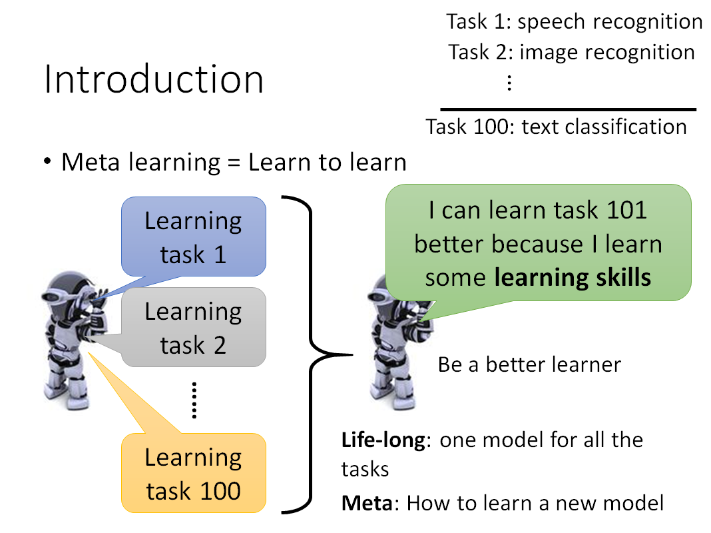
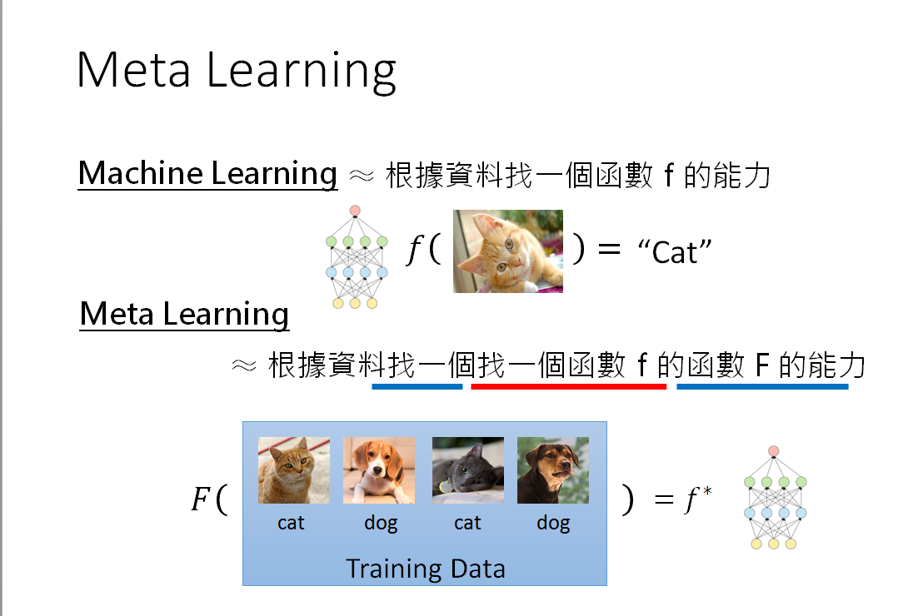
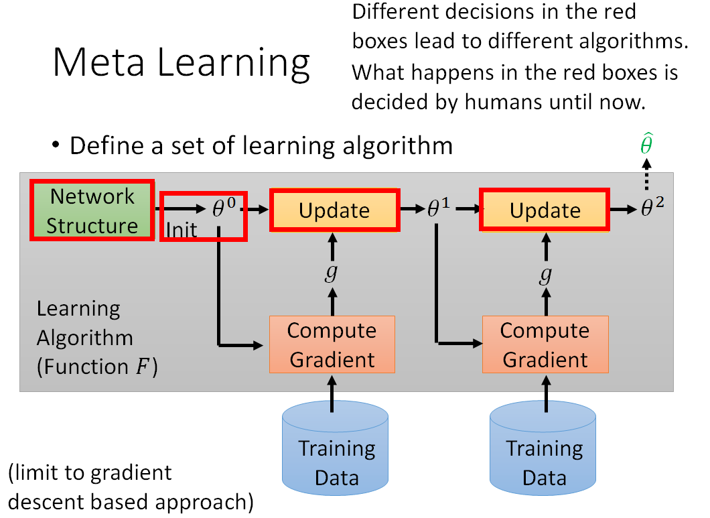
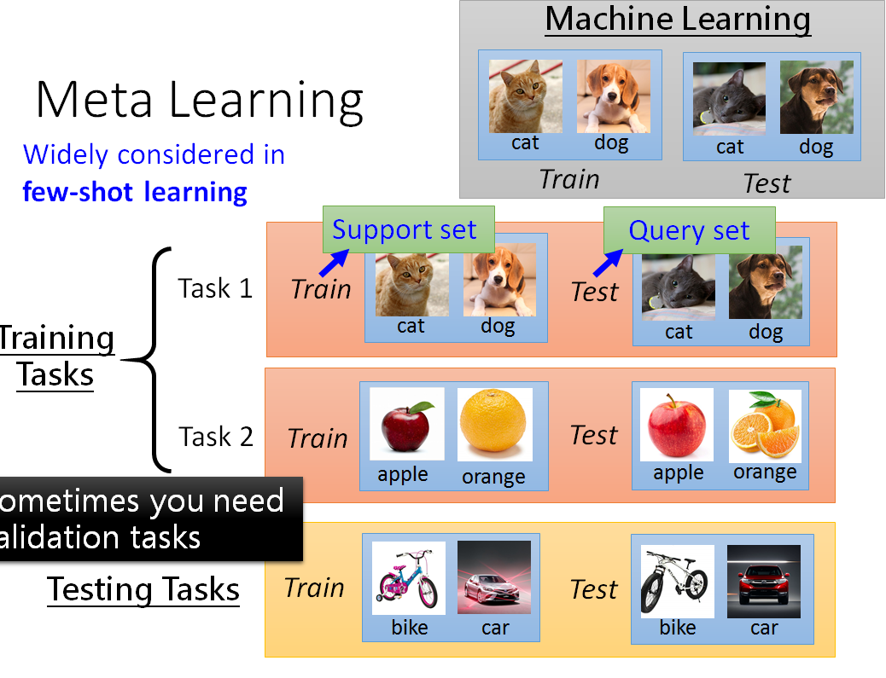
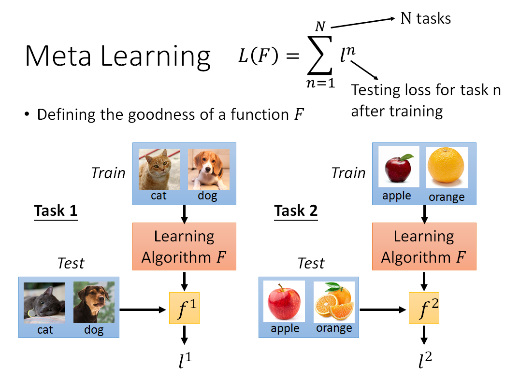
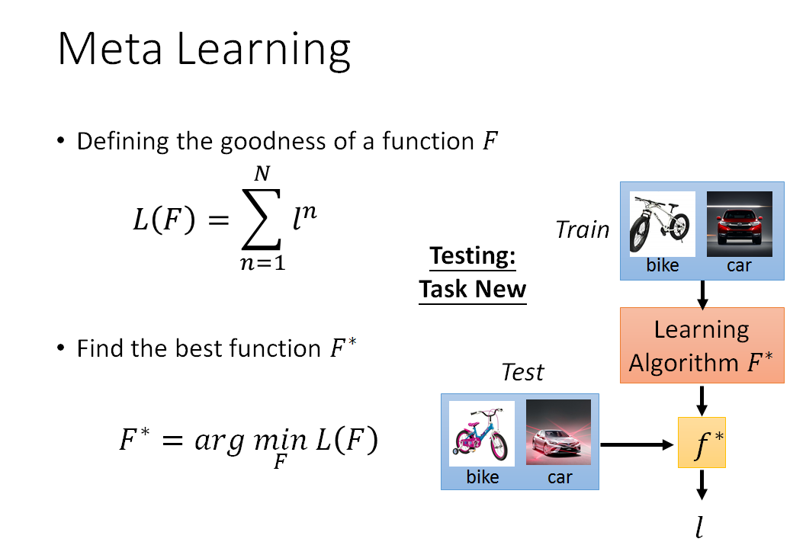
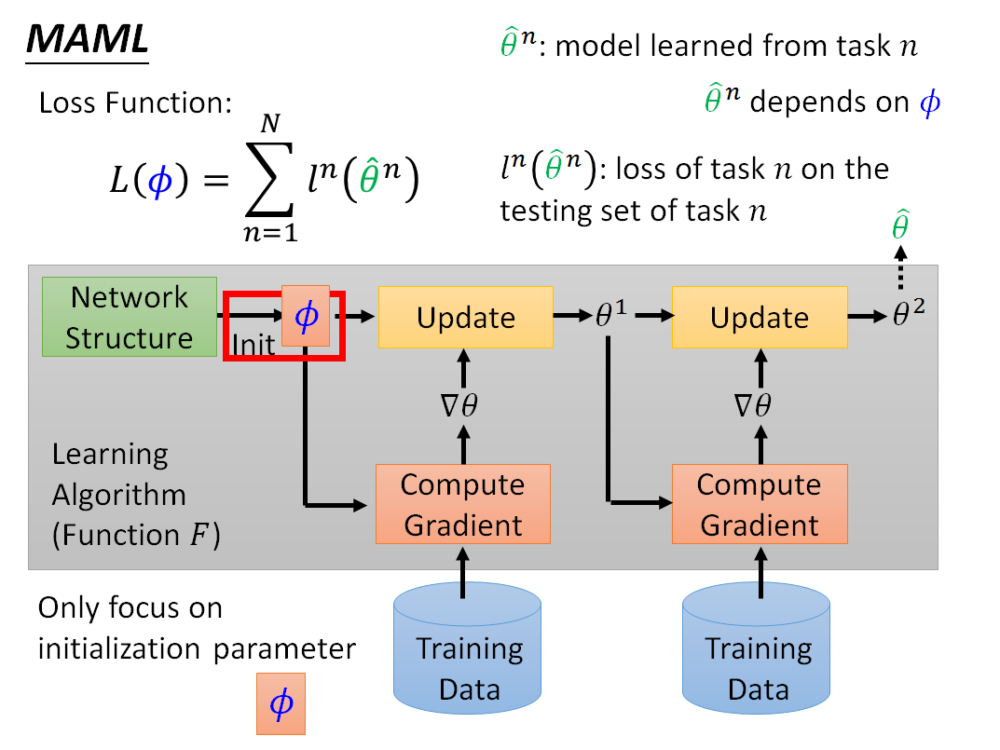
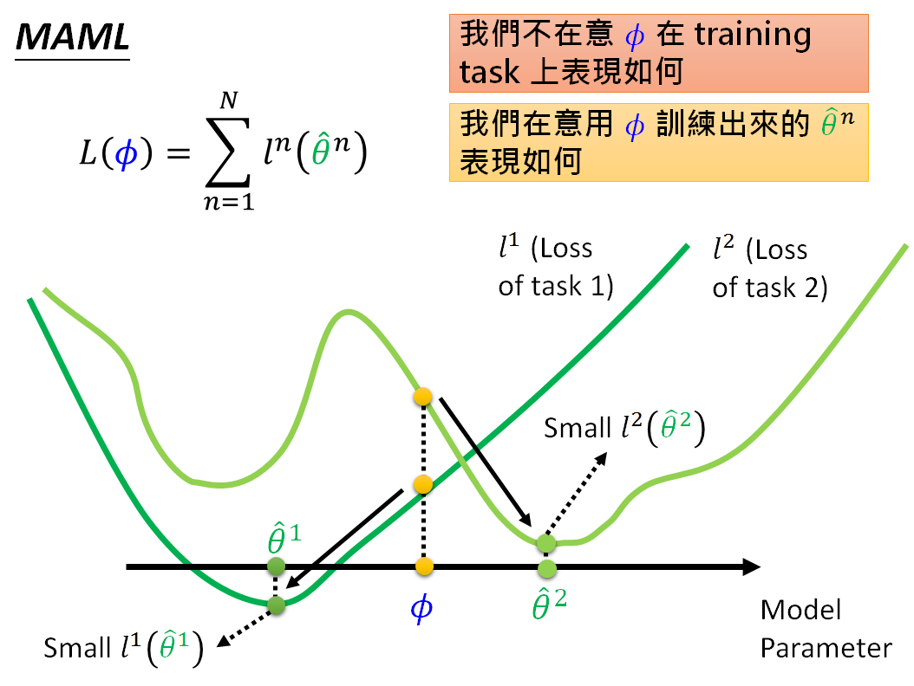
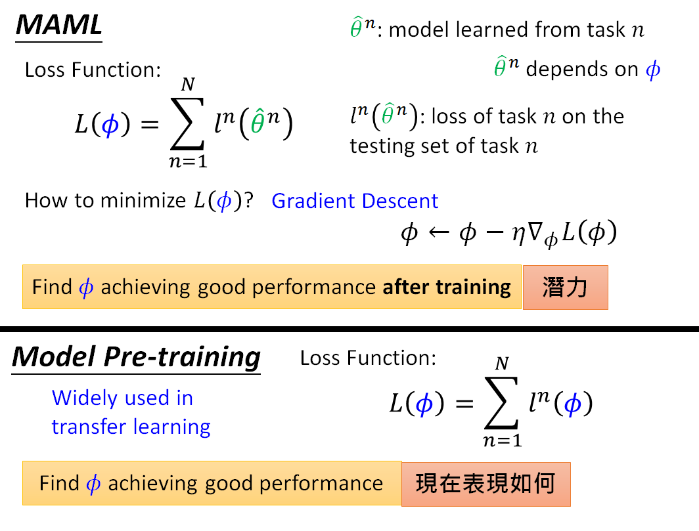

## 一、 one-shot learning

在了解meta-learning之前先大概了解一下one-shot learning。

与传统的deep learning方法不同，one-hot主要考虑现实中训练好的模型在实际使用时(target dataset)
需要面对每个类只有1个标注数据(one shot learning)或者极少数标注数据(few shot learning)的情况。

所以one hot最大的障碍就是缺少足够的训练数据。

现有的one hot学习方法可以被分为：

* direct supervised learning-based approaches;

* transfer learning-based one-hot recognition;

### 1.1 direct supervised learning-based approaches

1. 直接在target数据集上用监督学习的方法对分类器进行训练；

2. 最简单的是使用non-parametric model，例如knn（不受到训练样本限制）;

3. 但knn得到的distance metric可能不准确，所以我们需要学习得到metric embedding;

4. 还有的方法是用对target里面的数据做增强来得到更多的训练数据；

以上的方法都没有用到知识迁移，在遇到新的类的时候还是没有办法应对，即做不到 lifelong learning；

### 1.2 transfer learning-based one-hot recognition

1. 这类方法与zere shot learning的想法类似，假定在不同的类之间存在可以用于辅助的训练数据；

2. 他们利用learning to learn(meta-learning)的方法，希望能够将辅助数据集上学到的知识迁移到每个类别只有1个或者几个样例的target数据集上。

3. 这些方法的不同之处主要有：
    * what knowledge is transferred；
    * how the knowledge is represented；

4. 具体而言可以在生成模型、特征和与语义属性中以模型的形式提取并共享信息；

5. 很多现有的zero-shot学习方法和知识迁移都是通过一个共享的embedding space来实现的；

6. embedding space可以通过神经网络、判别分类器、内核嵌入方式获取得到；

##二 meta-learning
### 1. meta-learning的概念---让机器学会学习（learn to learn）
想较于之前的机器学些算法，meta learning 是让机器学会学习。
之前的机器算法只是希望机器学习一个函数f，通过这个函数，来判断这个图片属于哪个类别，
这段话是正面还是负面，但是meta learning 是希望机器在学习了几个图片分类任务之后，
可以学会文本分类的任务。

###2. 与机器学习的区别

* 机器学习的目标是通过训练集寻找到一个最优的参数f,
* meta-learning 是通过一堆学习资料学习一个参数f，使这个f具有学习F的能力，让F在指定任务上具有良好的能力

###3. meta learning是如何进行训练和实现的

* meta-larning 训练过程

主要的思想是，首先用户自己设计一个网络结构，然后在不同的任务上进行训练，得到一个模型的参数，然后将这个参数用指定的任务进行更新

为了区别指定任务和训练集，meta learning 定义了 support set和querys set ,每个不同的任务，将数据集分为，
support set和query set,如下图：

不同的任务由support set训练，然后通过query set求的损失，将所有任务上的测试集损失相加，然后得到meata-learning
的总的损失，再用这个损失去更新模型。

meta learning 的思想在few-shot learning上有广泛的应用。
因为meta learning 需要跑很多的任务，所以通常每个任务的数据集并不是很多，不然需要耗时很久啊。
损失函数和优化方法，就是在不同的任务上效果更好一些

##三. MAML--经典的meata-larning
MAML是学习一个最好的初始化的方法，如何评价呢，采用这个方法初始化参数，之后看不同任务上的效果。

与预训练模型区别是MAML侧重于找到一个φ，有很大的潜力可以让模型的效果得到提升，
使用梯度下降法之后可以得到最优的解。
model pre-training就是比较注重φ当前的表现，找到一个φ在所有的任务上表现好。

在MAML中，每个任务的参数更新，一般只做一步，这样做，一方面是模型训练可以很快，同时训练一步效果已经ok了。

    

