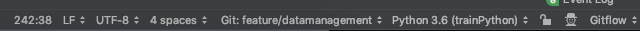

#gitflow的使用方法
工具Git-flow是按照Vincent Driessen的branch 模型，实现的一个高层次（级别）的git仓库操作扩展集合。 
在git-flow中，一切被划分为分支。 当你开始一个新特性的时候，你会基于develop分离出一个新的分支。 如果你在进行hotfix, 那么你是从master上分离的. 
使用git-flow模型，在于明白每个分支是从哪个分支分离出来，最终应该合并到哪些分支去。

##Mac中安装

* 使用Homebrew安装 
```
brew install git-flow
```

* 使用MacPorts安装 
```
port install git-flow
```

* 使用curl进行安装，我的mac是采用这种方法的，证明比较实用
```
curl -L -O https://raw.github.com/nvie/gitflow/develop/contrib/gitflow-installer.sh
sudo bash gitflow-installer.sh
```

##gitFLow介绍


##gitflow常用分支

* Production 分支 

&ensp;&ensp;也就是我们经常使用的Master分支，这个分支最近发布到生产环境的代码，最近发布的Release， 这个分支只能从其他分支合并，不能在这个分支直接修改


* Develop 分支 

&ensp;&ensp;这个分支是我们是我们的主开发分支，包含所有要发布到下一个Release的代码，这个主要合并与其他分支，比如Feature分支

* Feature 分支 

&ensp;&ensp;这个分支主要是用来开发一个新的功能，一旦开发完成，我们合并回Develop分支进入下一个Release。一般开发者首先使用的就是这个分支，我们从master clone到本地后，新建一个新功能点的分支，
然后在这个分支上进行功能开发。功能开发后，会合并到develop并删除掉这个分支

* Release分支 

&ensp;&ensp;当你需要一个发布一个新Release的时候，我们基于Develop分支创建一个Release分支，完成Release后，我们合并到Master和Develop分支

* Hotfix分支 

&ensp;&ensp;当我们在Production发现新的Bug时候，我们需要创建一个Hotfix, 完成Hotfix后，我们合并回Master和Develop分支，所以Hotfix的改动会进入下一个Release

## gitflow终端命令使用

* 创建develop分支
```
git branch develop
git push -u origin develop
```
* 开始新Feature开发
```
git checkout -b some-feature develop
# Optionally, push branch to origin:
git push -u origin some-feature    

# 做一些改动    
git status
git add some-file
git commit

```
* 完成Feature
```
git pull origin develop
git checkout develop
git merge --no-ff some-feature
git push origin develop

git branch -d some-feature

# If you pushed branch to origin:
git push origin --delete some-feature
```
* 开始Relase
```
git checkout -b release-0.1.0 develop
```
* 完成Release
```
git checkout master
git merge --no-ff release-0.1.0
git push

git checkout develop
git merge --no-ff release-0.1.0
git push

git branch -d release-0.1.0

# If you pushed branch to origin:
git push origin --delete release-0.1.0   

git tag -a v0.1.0 master
git push --tags
```
* 开始Hotfix
```
git checkout -b hotfix-0.1.1 master
```
* 完成Hotfix
```
git checkout master
git merge --no-ff hotfix-0.1.1
git push

git checkout develop
git merge --no-ff hotfix-0.1.1
git push

git branch -d hotfix-0.1.1

git tag -a v0.1.1 master
git push --tags
```

#上面的都不重要，因为我们都用GUI了，pycharm这么高大山

1.下载gitflow
* 使用curl进行安装，我的mac是采用这种方法的，证明比较实用，记得下载完要运行
```
curl -L -O https://raw.github.com/nvie/gitflow/develop/contrib/gitflow-installer.sh
sudo bash gitflow-installer.sh
```
2. 在pycharm中下载gitflow插件
     


3. 初始化



这个地方有个大坑。正常情况下可以直接初始化的，但是由于我的电脑本身自带git的原因，
导致git版本有问题，一直无法初始化。在终端只用这个方法即可
```
gitflow.prefix.bugfix
```
4 . 即可进行GUI操作了，点击gitflow ->start feature 开始新的分支


##git rm与git rm --cached
```
当我们需要删除暂存区或分支上的文件, 同时工作区也不需要这个文件了, 可以使用
1 git rm file_path
2 git commit -m 'delete somefile'
3 git push

当我们需要删除暂存区或分支上的文件, 但本地又需要使用, 只是不希望这个文件被版本控制, 可以使用
git rm --cached file_path
git commit -m 'delete remote somefile'
git push

```