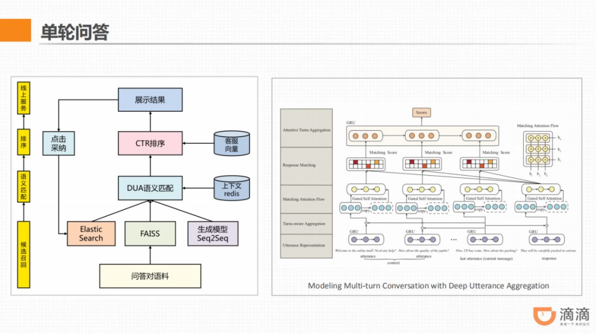

对话系统会分为很多种形式，包括单轮，多轮，闲聊，对话管理等等模块，而单轮对话目前的主要方法是基于检索式，检索的方法主要有语义匹配



除了分类的结构，我们也尝试了搜索+语义匹配+排序的架构，主要是用来做情绪安抚，
思路是把候选的问答对语料，通过搜索、生成式模型得到候选，然后经过粗排，
粗排是用文本相关性的分数来计算，最后交给多轮对话深度匹配模型，主要参考了去年这篇的论文：Modeling Multi-turn Conversation with Deep Utterance Aggregation ，DUA 的特点是除了计算当前的对话，还会把上下文建模进来，重新考虑。比如情绪回复，如果是一个负向语句，如果单看这句话，它的回复可能是非常通用的，但是结合上下文，比如有的司机听不到单了，然后他会回复一些负面语句，这时我们的回复是针对听单场景的安抚。

##基于BM25的检索式答案检索

```

```